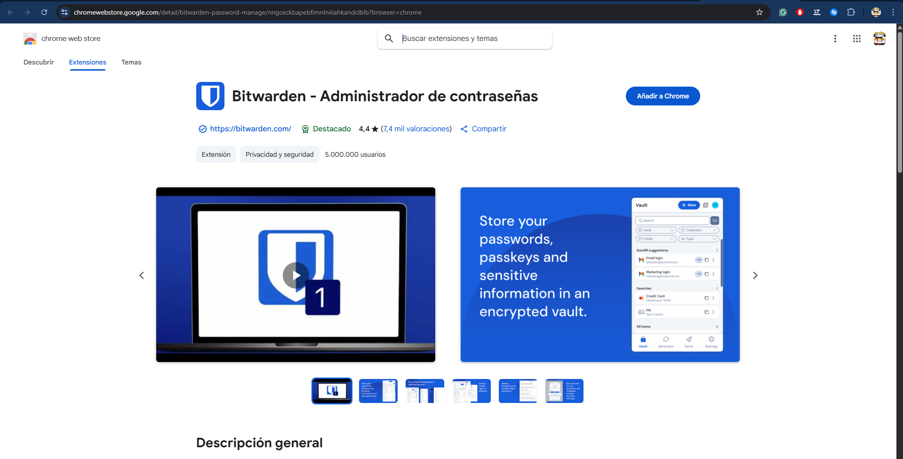
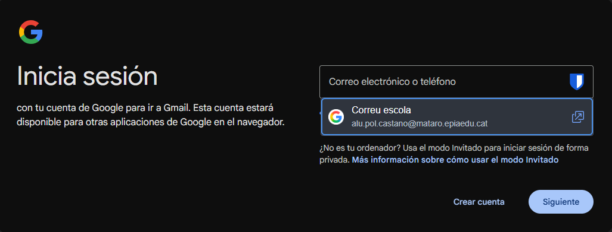
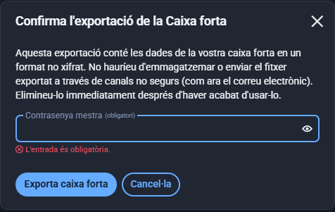

#### 

- Per començar, escriurem a la barra cercadora de Google **bitwarden.com** i farem clic a **Downloads**, a la barra d’adalt, el que farà que surti la següent pàgina.  
    
- Li donarem a **Desktop** i instal·larem segons el nostre sistema operatiu; en aquest cas, Windows.  
    
- Obrirem l’arxiu descarregat anteriorment i seguirem amb la instal·lació.  
  

- Quan obrim el programa després de la instal·lació, ens sortirà la següent finestra, on farem clic a **Crea un compte**.  
    
- Posarem una adreça de correu electrònic i el nostre nom.
    
- Ens demanarà que verifiquem el nostre correu; un cop cliquem al link, ens sortirà la pantalla per crear la nostra contrasenya.  
    
- Ara crearem la nostra contrasenya mestra; assegura’t que segueix el mínim de caràcters.  
    
- Un cop fet tot això, anirem a l’aplicació i iniciarem sessió.  
    
- Un cop iniciada la sessió amb la contrasenya d’accés, ens sortirà el següent menú.  
  

- Ara farem clic al **\+** i seleccionarem **Inici de sessió**.  
    
- Configurarem els paràmetres, com el nom que tindrà aquesta contrasenya; normalment voldrem que sigui un nom fàcil de recordar, per saber de què és aquesta contrasenya, i haurem de posar la contrasenya, etc.  
    
    
- Ara tenim una eina molt interessant: podem clicar a la dreta del camp de l’usuari o la contrasenya i utilitzar un generador de contrasenyes segures, en el qual podrem canviar la quantitat de caràcters que volem i si volem només lletres minúscules, majúscules, números o caràcters especials.  
    
- Com a pas final de la configuració, anirem a **Opcions d’emplenament automàtic** i omplirem el camp **Lloc web**.  
    
- Ara tornarem a **bitwarden.com/download** i baixarem una mica, on veurem aquesta part per descarregar una extensió per al teu navegador; això permetrà que s’autocompleti la contrasenya.  
  

- Ara entrarem a l’extensió de Google i iniciarem sessió al nostre Bitwarden.  
    
    
- Un cop la sessió iniciada, podrem veure aquest menú a l’extensió.  
    
- Quan entrem a la pàgina on vam posar l’autocompletar la vegada anterior, ens sortirà la següent barra i podrem autocompletar.  
    
- Per exportar la caixa amb les contrasenyes, farem clic a **Fitxer \> Exporta caixa forta**.  
    
- Ens sortirà la següent finestra, on podrem escollir quin tipus volem que sigui l’arxiu exportat de Bitwarden.  
  

- Un cop fet això, haurem de posar la clau mestra i ja estaria.

**De quina manera hauríem de protegir l’arxiu?**

Quan fem una còpia de seguretat de les nostres contrasenyes, estem gestionant informació extremadament sensible. Per això, és imprescindible assegurar que aquest arxiu estigui protegit contra accessos no autoritzats. Hi ha diverses maneres de fer-ho, i la millor pràctica depèn de les necessitats específiques, però aquí tens les recomanacions generals:

**Emmagatzematge en un dispositiu físic xifrat (per exemple, USB):**  
 Guardar la còpia de seguretat en un dispositiu extern com un pendrive USB és una bona opció, perquè mantens el control físic de l’arxiu. No obstant això, per evitar que si algú perd el dispositiu o el roba pugui accedir a la informació, cal protegir-lo mitjançant xifrat.

* Una eina habitual a Windows és **BitLocker**, que xifra tot el contingut del pendrive i només es pot accedir amb una contrasenya o clau d’encriptació.

* Altres sistemes operatius tenen opcions similars (per exemple, FileVault a macOS o LUKS a Linux).  
   Aquesta combinació permet portar la còpia de seguretat sempre amb tu, però assegurant que ningú no autoritzat pugui accedir-hi fàcilment.
