# 🧭 **Serveis de Directori: LDAP**

📅 **Data:** 13/11/2025  
👤 **Autor:** Pol Castaño Meneses

#### 

## **1. Requeriments d'Infraestructura Inicial**

- Començarem actualitzant el nostre Ubuntu Server.  

- Ara utilitzarem `sudo nano /etc/hosts`  

- Canviarem el nom de la màquina i li posarem un domini.  

- Comprovarem que el nom hagi sigut canviat amb:  
  `hostname -f`  
  
- Ara posarem dues interfícies de xarxa: una en **NAT** i l’altra en **adaptador només l’amfitrió**.  

- Configurarem l’adaptador de xarxa i posarem el segon adaptador amb **dhcp4**.  

- Ara aplicarem els canvis als adaptadors amb:  
  `sudo netplan apply`  

## **2. Instal·lació i Configuració Base d'OpenLDAP**

- Ara instal·larem OpenLDAP amb la següent comanda:  
  `sudo apt install slapd ldap-utils -y`  

- Un cop instal·lat, ens sortirà per posar-li una contrasenya per a l’administrador del directori LDAP.  

- Un cop finalitzada aquesta petita configuració, comprovarem amb: `systemctl status slapd` si s’ha instal·lat correctament.  

- Ara, per veure si està ben configurat, utilitzarem: `sudo slapcat` amb el qual podrem observar el domini configurat.  

- **EN CAS** que tinguem alguna cosa malament (com el nostre domini) o haguem posat una contrasenya que no volem, o si la volem canviar, utilitzarem:  
  `sudo dpkg-reconfigure slapd`  

- Ara crearem un fitxer `.ldif` per a la configuració dels nostres OUs amb:  
  `sudo nano nom_fitxer.ldif`   

- Ara començarem a escriure el nostre fitxer de configuració amb el qual crearem les següents OUs dins del nostre directori LDAP.  

- Per afegir aquestes OUs dins del nostre directori LDAP utilitzarem la comanda:  
  `ldapadd -D “cn=admin,dc=innovatech06,dc=test” -W -f innovatech06.ldif`   
  (el que posa a `dc=` depèn del nostre domini)  

- Per buscar les OUs que hem creat dins del nostre directori LDAP utilitzarem:  
  `ldapsearch -xLLL -b “dc=innovatech06,dc=test”`  

## **3. Gestió i Administració (LAM)**

- Instal·larem el gestor d’usuaris LDAP (LAM) amb:  
  `sudo apt install ldap-account-manager -y`  
 
- Obrirem una finestra al navegador que preferim i posarem la nostra IP de la interfície **Host-Only** amb un `/lam`. S’obrirà el panell gràfic.

- Dins d’aquest panell gràfic, anirem a la part superior dreta a **LAM configuration**.  

- Un cop aquí, seleccionarem **Edit server profiles**.  

- Posarem les credencials per defecte:  
- **Password:** lam  
- **Profile name:** lam  
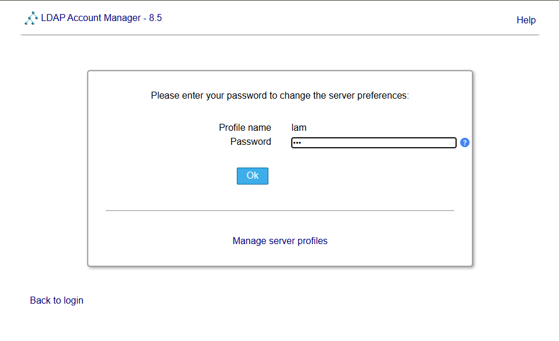
- Anirem a **General settings** i canviarem la **list of valid users** per marcar quins usuaris poden entrar al LAM. Després, baixarem a **Tool settings** i posarem el nostre domini.  
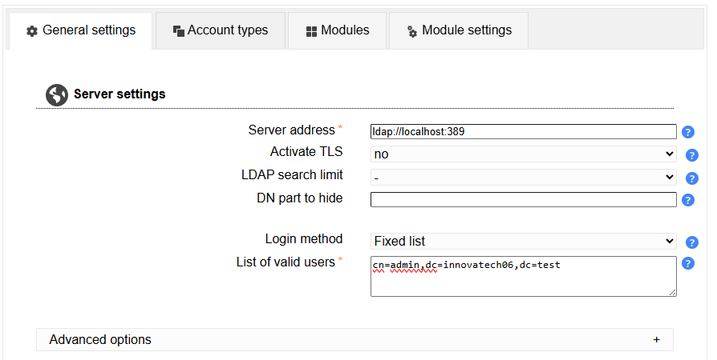
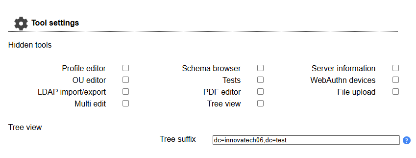
- Li donem a **Account types** i posem a **LDAP suffix** el nom del nostre OU de **users** i **groups**, afegint el nostre domini.  
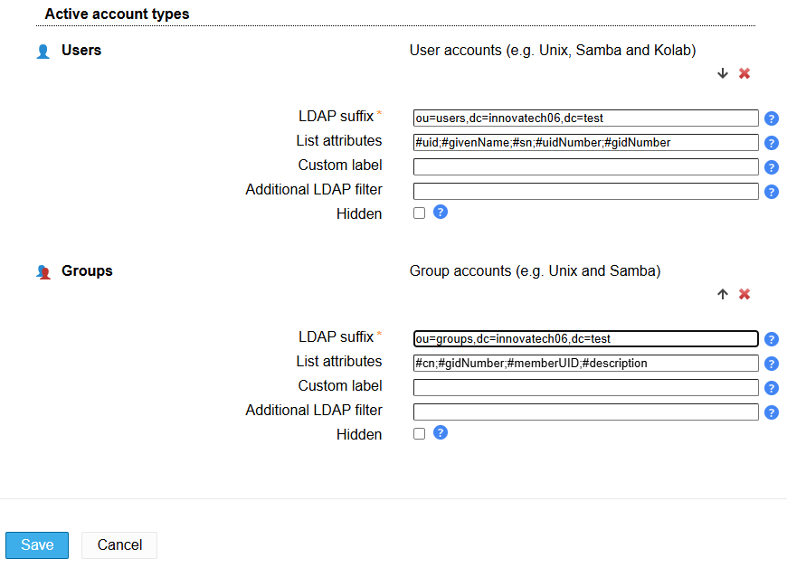 
- Li donarem a **Save**.
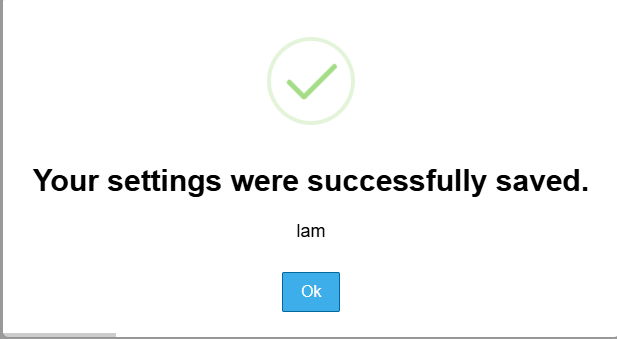  
- Un cop fet això, ens tornarà al login del LAM. Entrarem amb la contrasenya que vam posar al principi a l’admin de LDAP.  
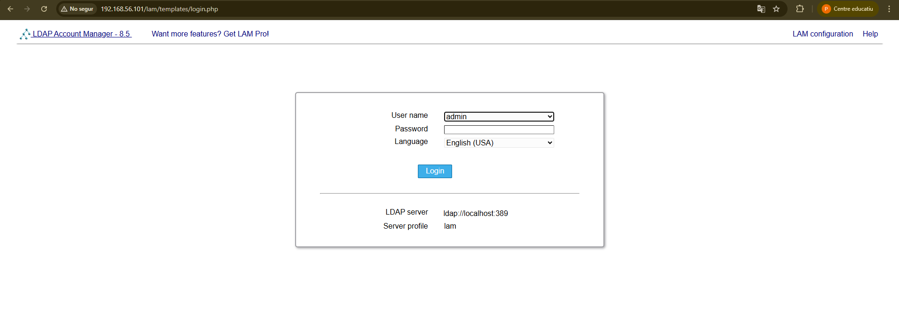
- Tindrem aquest menú de **Users**. Li donarem a **Accounts** a dalt a la dreta i anirem a **Groups**.  
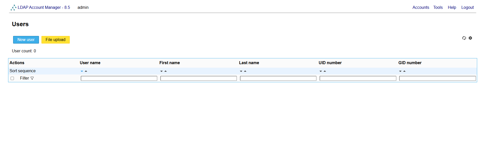

- Dins de **Groups**, li donarem al botó blau **New group**.  
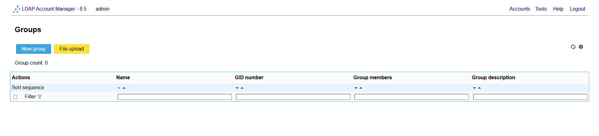
- Li posarem el nom tech i premem el botó blau **Save**.  
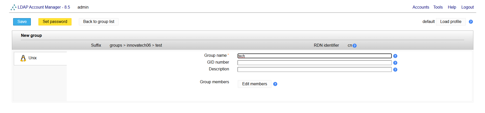
- Premem el botó groc **Create another group**.  
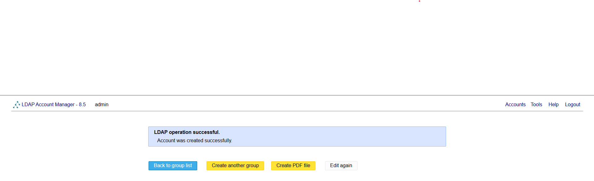
- Crearem un altre grup que sigui manager.  

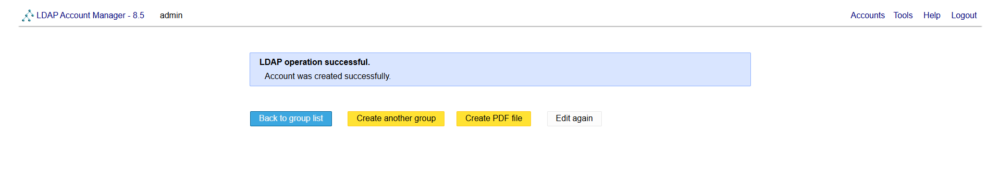
- Al menú de **Groups** podrem veure els dos grups que hem creat. Com a següent pas, li donarem a **Accounts** un altre cop i anirem a **Users**.  

- Dins de **Users**, li donarem a **New user**.  
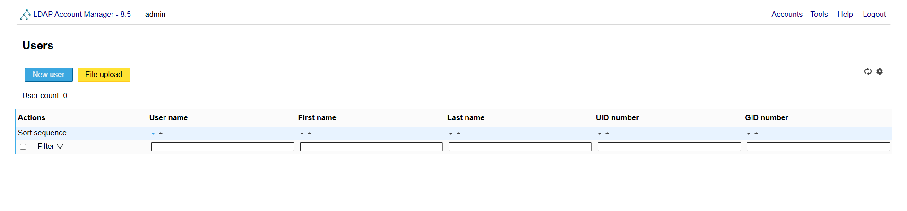
- Aquí li posarem el nom al nostre usuari, en aquest cas tech01, amb el last name innovatech.  
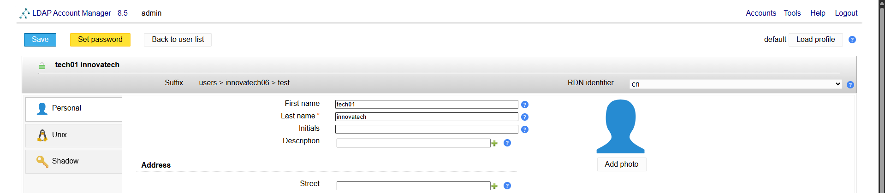
- Fem clic a **Unix**, on configurarem **username** i posarem com a **common name** tech01 innovatech. Com a pas addicional, activarem l’opció **create group with same name**, que ens crearà i posarà com a grup principal un nom igual que el de l’usuari.  

- Li donarem a **Edit groups** i ens sortirà el següent menú. Això serveix per posar com a grup secundari el grup que vulguem; en aquest cas posarem `tech` com a grup secundari i li donem a **Back**.

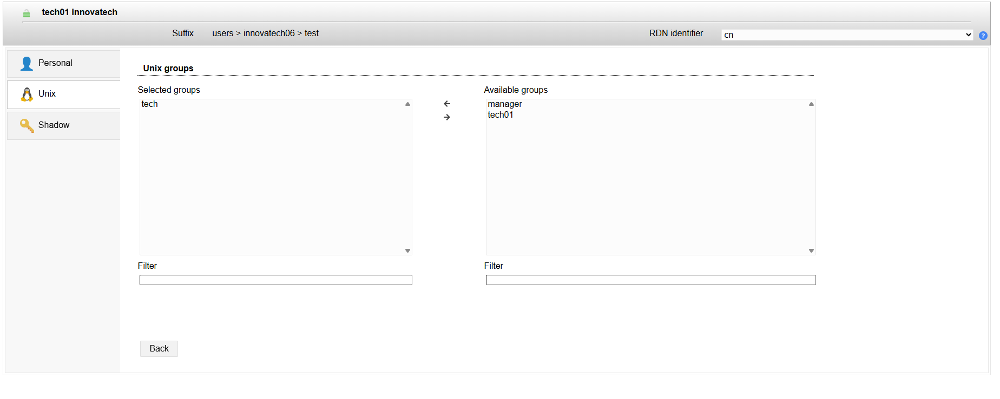
- Tornarem al menú i li donarem al botó groc **Set password**.  
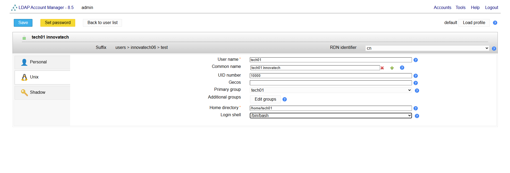
- Dins del següent menú podrem posar una contrasenya; en aquest cas posarem una contrasenya genèrica i activarem l’opció **Force password change**. **IMPORTANT:** activar l’opció **Unix**.  
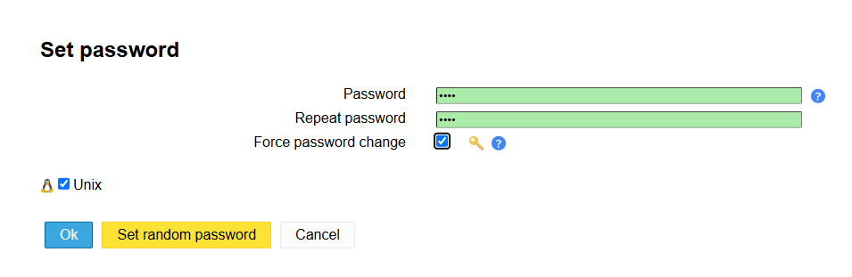
- Un cop fet això, li tornarem a donar a **Save** i seguirem el mateix procés per crear un usuari amb el nom manager01.  

## **4. Integració de Client (Client Zorin Desktop)**

- Configuració de xarxa de la màquina virtual.  
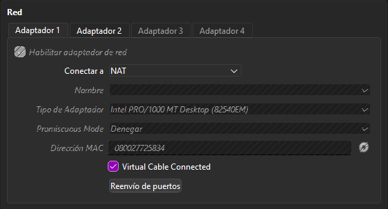
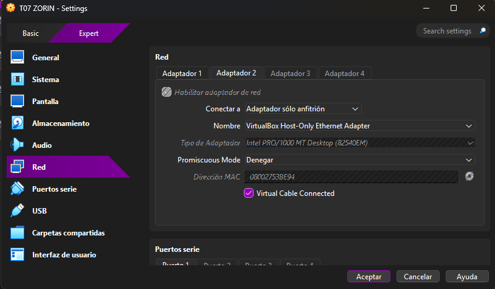
- En un terminal a la nostra màquina Zorin editarem el nom de la nostra màquina amb:  
  `sudo nano /etc/hosts`  

- Com no tenim servidor DNS, a part de canviar el nom també posarem la IP de la nostra màquina servidor i el seu nom.  
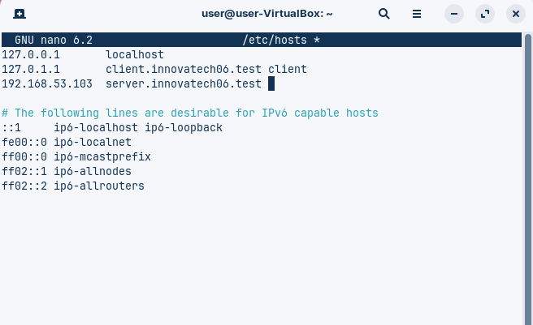
- Amb `sudo nano` també editarem l’arxiu `hostname`, però només posarem el nom curt de la màquina.  
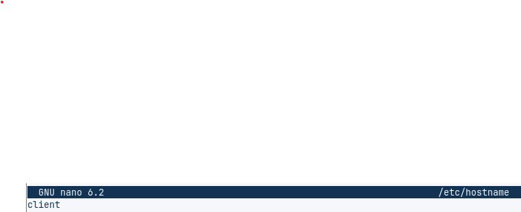
- Comprovarem amb: `hostname -f` que el nom ha sigut assignat correctament i amb `dig server.innovatech06.test` que resol el servidor.
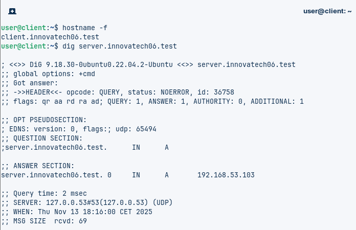
- Instal·larem els mòduls necessaris per usar **libpam** i **nss** amb la comanda:  
  `apt install libnss-ldap libpam-ldap ldap-utils nscd -y`  
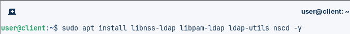
- En aquest pas posarem el nom complet del nostre servidor LDAP.  
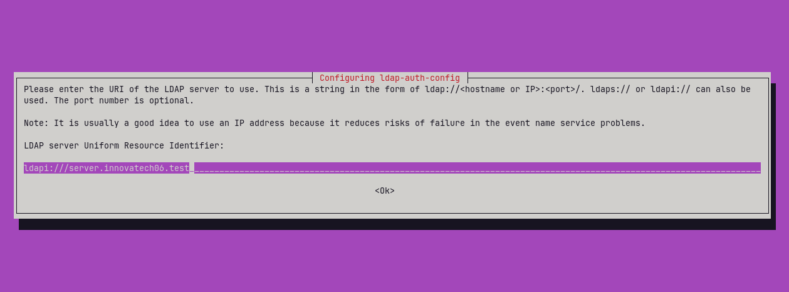
- En aquest pas haurem de col·locar el nostre domini.  
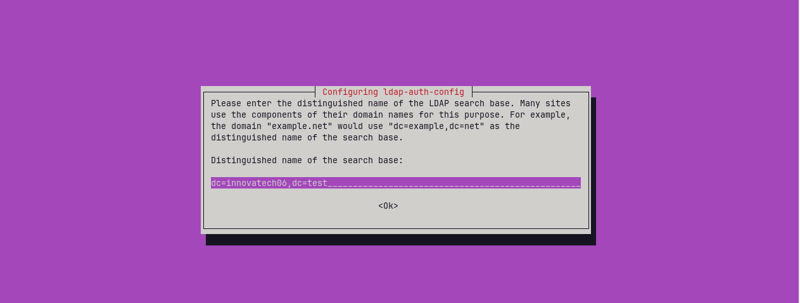
- Seleccionarem la versió 3 de LDAP.  
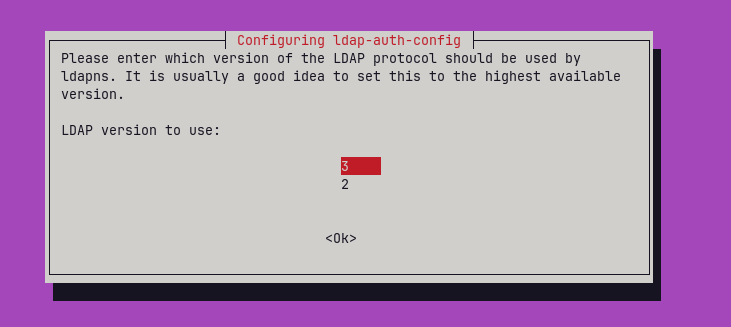
- Escollirem les següents opcions.  
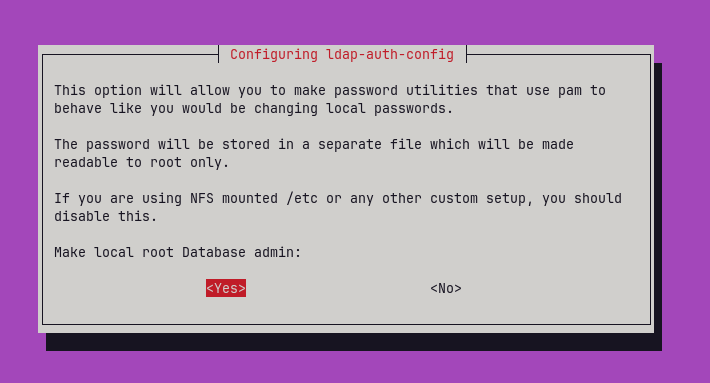 
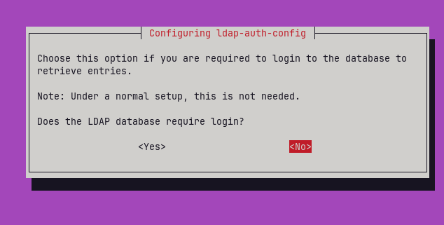
- Aquí posarem l’usuari administrador del nostre directori LDAP.  
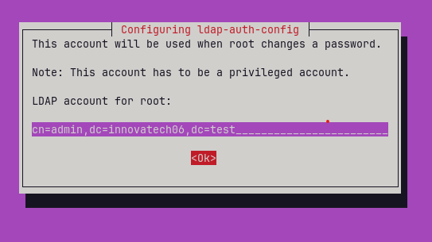
- Escriurem la nostra contrasenya del directori LDAP.  
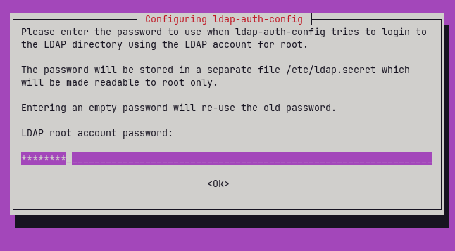
- Un cop acabada aquesta configuració inicial, farem una consulta des del client per veure si connecta correctament amb el servidor amb:  
  `ldapsearch -x -D ‘cn=admin,dc=innovatech06,dc=test’ -W -H ldap://server.innovatech06.test -b ‘dc=innovatech,dc=test’ ‘objectClass=posixAccount’ uid`  
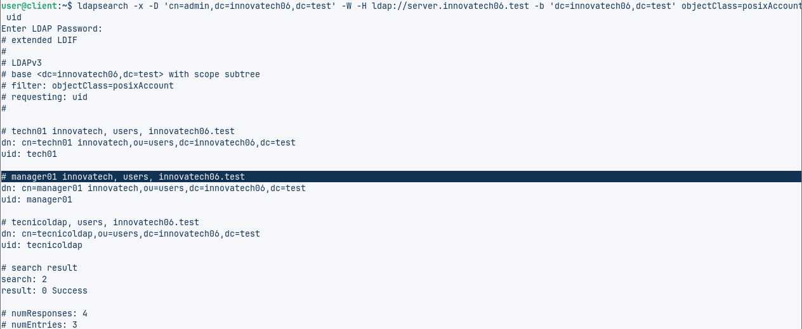
- Ara editarem l’arxiu `nsswitch.conf` per indicar que s’utilitzarà LDAP per usuaris i grups:  
  `sudo nano /etc/nsswitch.conf`  
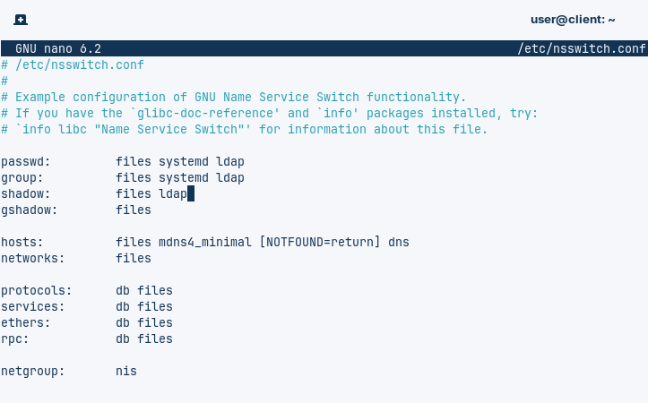
- A l’arxiu `/etc/pam.d/common-password` eliminarem a la quarta línia el terme `use authtok`. Editarem l’arxiu amb:  
  `sudo nano /etc/pam.d/common-password`   
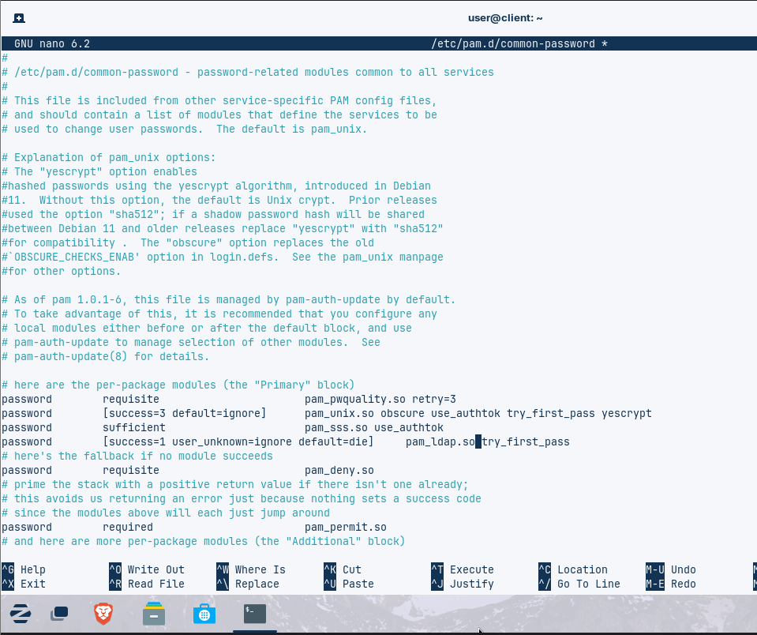
- Ara editarem l’arxiu `/etc/pam.d/common-session` amb la comanda i haurem d’afegir la següent línia:  
  `sudo nano /etc/pam.d/common-session`  
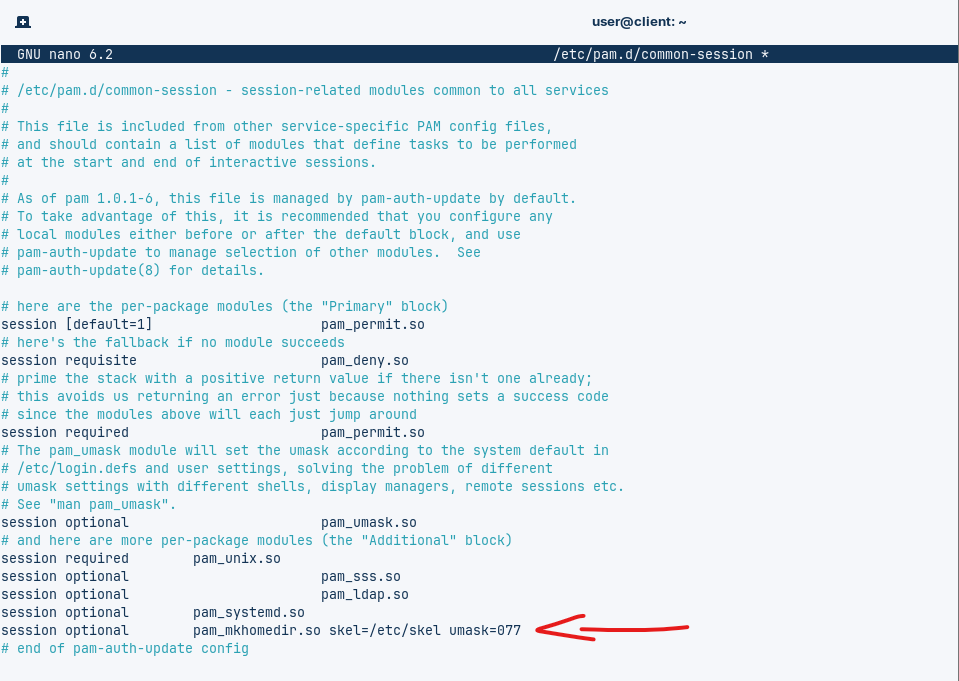
- A continuació reiniciarem `nscd` amb:  
  `sudo systemctl restart nscd`  

- Comprovarem que podem veure els usuaris de LDAP des del client amb:  
  `getent passwd | tail`  
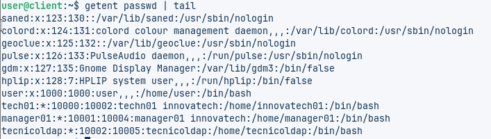 
- Ara editarem l’arxiu indicat que permetrà l’inici de sessió gràfica; haurem d’afegir la línia marcada amb una fletxa:  
  `sudo nano /etc/pam.d/gdm-launch-environment`  
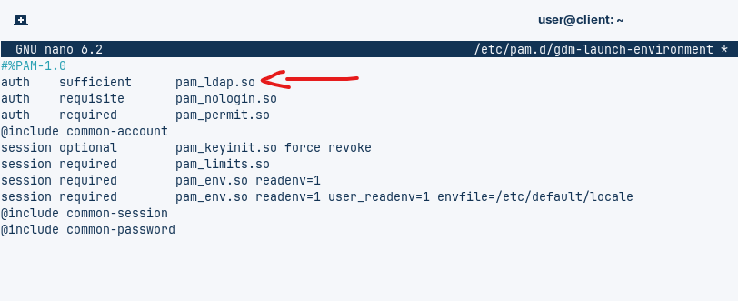
- Ara reiniciarem la màquina client i intentarem entrar amb un usuari del directori.  
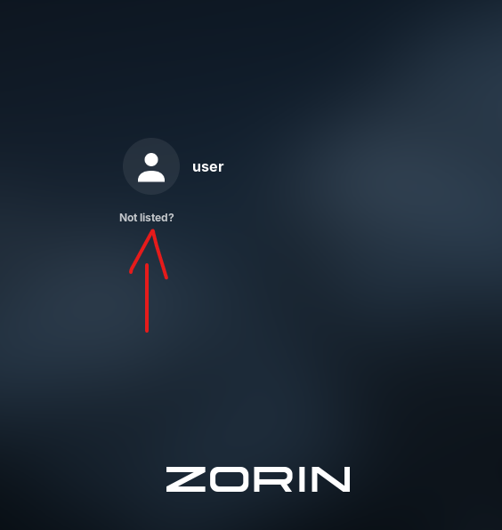
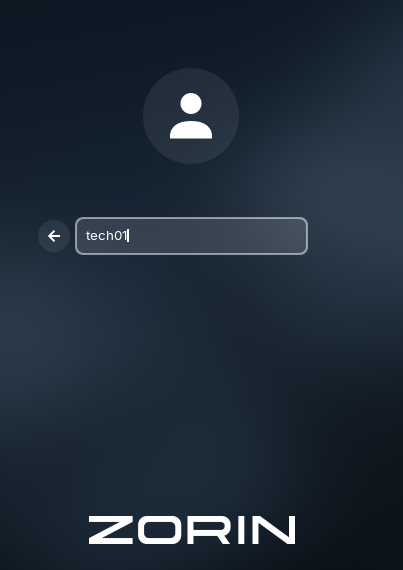

- Com podem veure, es crea automàticament el directori personal.  

- Amb `id` comprovarem que estem a l’usuari indicat.  
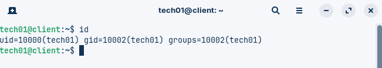

