# 🔐 T06: Fonaments del servei DNS — Formació i Diagnosi per a DigiCore

Com a membres cada cop més integrats de l’equip tècnic de la consultora EverPia, teniu davant un nou repte. El vostre client, una empresa de màrqueting digital (DigiCore), experimenta errors de connectivitat en certes aplicacions. El seu equip tècnic sospita que la causa principal podria ser una resolució de noms (DNS) incorrecta o lenta.

En resposta, se us ha encarregat realitzar una auditoria teòrica i pràctica del servei DNS per tal de formar el personal del client i oferir eines de diagnosi ràpides.

---

## 🎯 Objectiu del projecte
- Formar el personal tècnic de DigiCore en els conceptes fonamentals del DNS.
- Preparar una píndola formativa en format vídeo (10-15 minuts) amb explicacions clares.
- Realitzar una auditoria pràctica amb eines CLI per diagnosticar possibles problemes de resolució de noms.

---

## 🧩 Tasques a realitzar

### **Fase Teòrica**
1. Explicar la jerarquia i estructura del DNS (Root > TLD > Segon nivell).
2. Descriure el procés de resolució (iterativa vs recursiva).
3. Tipus de zones: directa, inversa, primària i secundària.
4. Tipus de registres clau: A, PTR, CNAME, MX, NS, SRV.
5. Conceptes essencials:
   - Resposta autoritativa
   - TTL (Time To Live)
   - SOA (Start of Authority)
   - Reenviadors (condicionals i incondicionals)
   - Resolució local (mDNS)
6. Preparar un vídeo formatiu amb esquemes i exemples.

---

### **Fase Pràctica**
#### Configuració inicial
- Per començar, tindrem dos adaptadors de xarxa: un en mode NAT i l’altre en mode adaptador pont.  
  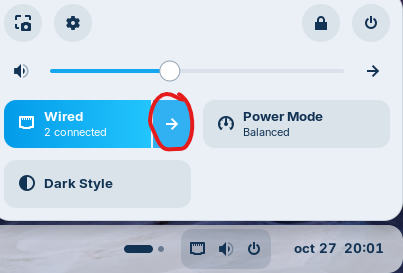  
  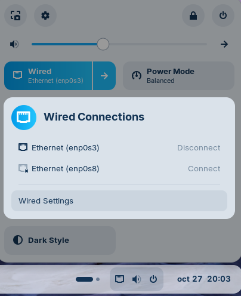  
- Farem clic a la barra inferior i seleccionarem la fletxa.  
  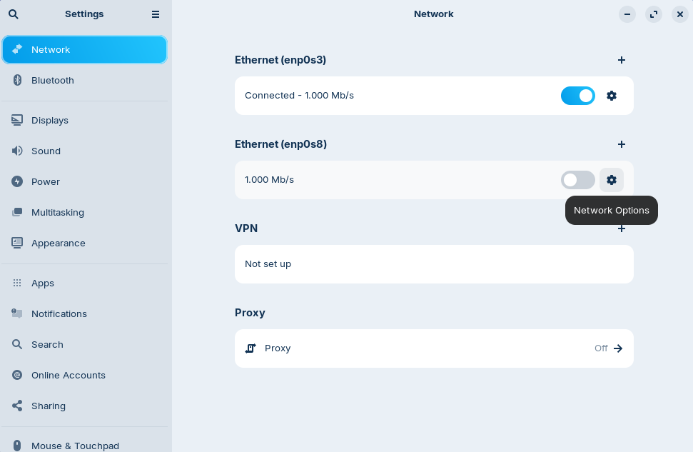  
- Ara farem clic a **Wired Settings**.  
  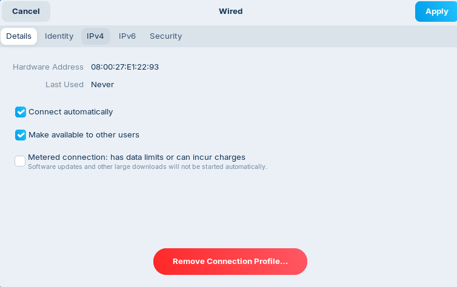  
- Anirem al segon adaptador de xarxa i el configurarem.  
  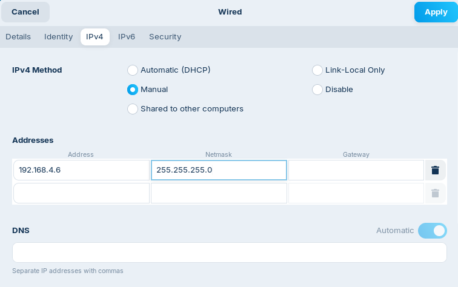  
- Anirem a la pestanya **IPv4**.  
  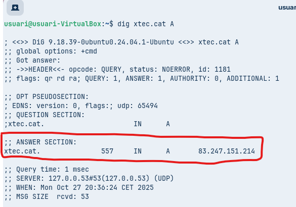  
- Seleccionarem l’opció **Manual**, configurarem l’adreça IPv4 i la màscara de xarxa, i finalment farem clic a **Apply**.  
  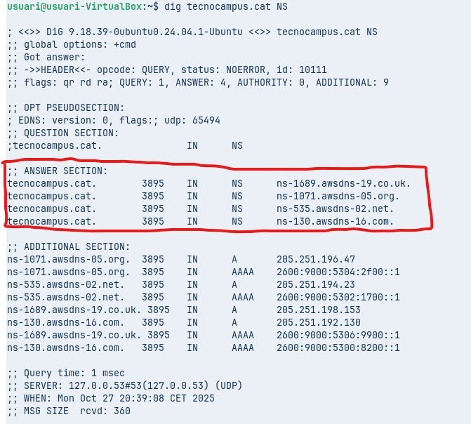  

---

#### **Comandes amb dig**
- **Comanda 1: Consulta Bàsica de Registre A**  
  - Executa `dig xtec.cat A`  
  - Anàlisi: Identifica la IP de resposta, el valor TTL i el servidor que ha respost a la consulta.  
    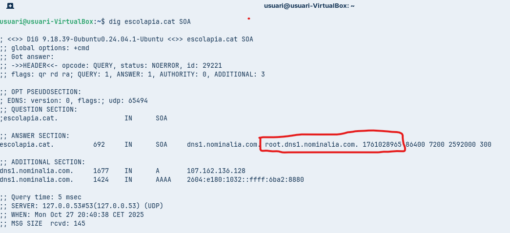  
    El valor TTL és **557** i el servidor que ha respost és **83.247.151.214**.  

- **Comanda 2: Consulta de Servidors de Noms (NS)**  
  - Executa `dig tecnocampus.cat NS`  
  - Anàlisi: Quins són els servidors de noms autoritatius per a aquest domini?  
    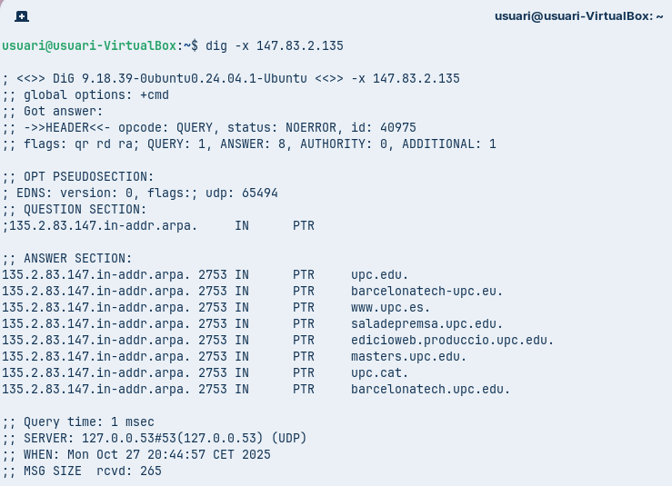  
    Els servidors autoritatius apareixen a la secció **Answer Section**, com per exemple `ns-1689.awdns-19.co.uk.` i els següents.  

- **Comanda 3: Consulta Detallada SOA**  
  - Executa `dig escolapia.cat SOA`  
  - Anàlisi: Quina és la informació del correu de l'administrador i el número de sèrie del domini?  
    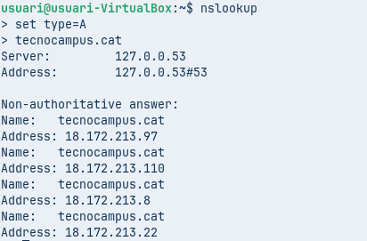  

- **Comanda 4: Consulta resolució inversa**  
  - Executa `dig -x 147.83.2.135`  
  - Anàlisi: Quina informació sobre els registres s’obté?  
    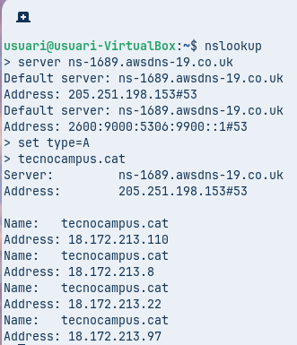  
    La informació dels registres que conté són de tipus **PTR**, que és l’oposat al registre A: mentre que un registre A associa un nom de domini amb una adreça IP, un registre PTR associa una adreça IP amb un nom de domini. També es pot apreciar que hi ha diversos noms de domini associats a la mateixa IP.

---

#### **Comprovació amb nslookup**
- **Comanda 1: Consulta Bàsica no Autoritativa**  
  - Seleccionar `type=A` i com a domini de consulta `tecnocampus.cat`  
  - Anàlisi: Per què indica que la resposta és no autoritativa?  
      
    És degut al fet que, com hem fet consultes prèvies, totes les dades ja es troben a la memòria cau, i quan es recuperen d’aquesta cache, s’indica que és una resposta no autoritativa.  

- **Comanda 2: Consultes autoritatives**  
  - Escriure `server IP` i escriure la IP del primer servidor de noms del domini `tecnocampus.cat` que s’ha obtingut d’una consulta anterior. A continuació, indiqueu que voleu consultar registres de tipus A i del domini `tecnocampus.cat`.  
  - Anàlisi: Quines diferències s’observen a la resposta obtinguda amb la comanda 1?  
      
    La diferència que puc observar és que no apareix la secció de **Non-authoritative answer**, ja que estem consultant directament el servidor autoritatiu.

---

### **Resolució Local**
Incloure proves amb mDNS o fitxer hosts per validar resolució sense servidor.  
  

---

## 📄 Solució

Un dossier complet amb:
- Material formatiu (vídeo + resum teòric).
- Document `guia.md` amb resultats pràctics, anàlisi i captures.

👉 [**Accedir a l’arxiu de solució**](./solució.md)  
👉 [**Accedir a la guia formativa DNS**](./T06_Guia.md)
